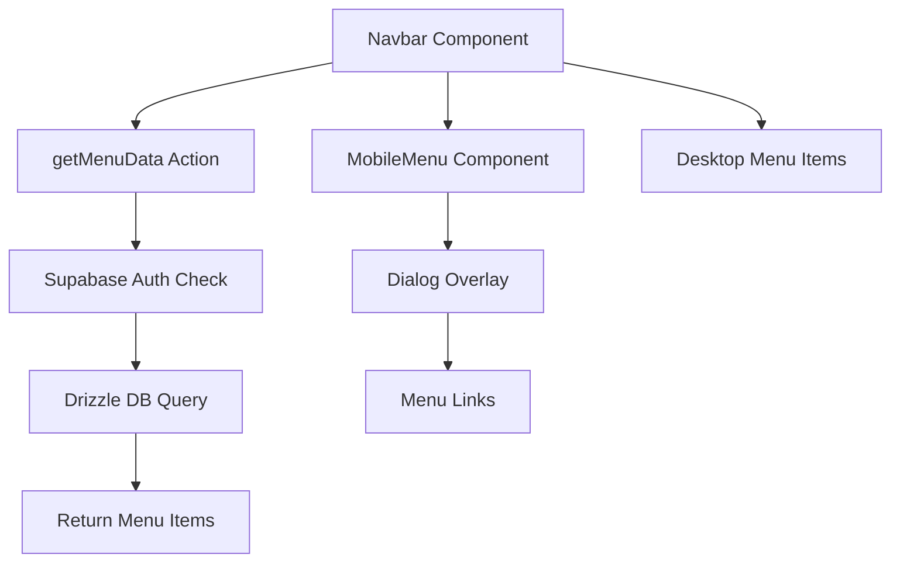

# Navbar Components Documentation

## Overview

The navbar system consists of three main components that work together to provide a responsive navigation experience:

1. **`actions.ts`** - Server actions for data fetching
2. **`index.tsx`** - Main navbar component
3. **`mobile-sidebar.tsx`** - Mobile menu implementation

## Architecture

### Server-Side Data Fetching (`actions.ts`)

The `getMenuData` server action handles authentication and database queries for menu items.

**Key Features:**
- **Authentication**: Validates user session using Supabase
- **Database Query**: Fetches menu items from the database using Drizzle ORM
- **Error Handling**: Comprehensive error handling with custom error messages
- **Type Safety**: Returns typed menu items (`SelectMenuItemType[]`)

**Flow:**
1. Validates user authentication via Supabase
2. Queries `menuItems` table ordered by ID
3. Returns menu data or throws error if unauthenticated/no data

### Main Navbar Component (`index.tsx`)

The `Navbar` component serves as the main navigation bar that adapts to different screen sizes.

**Features:**
- **Server Component**: Renders on the server for optimal performance
- **Responsive Design**: Shows different layouts for mobile/desktop
- **Dynamic Menu**: Renders menu items fetched from the database
- **Cart Integration**: Includes cart modal trigger

**Structure:**
```tsx
<nav>
  <MobileMenu />          // Mobile menu button (hidden on desktop)
  <Logo + Site Name />    // Branding section
  <Menu Items />          // Navigation links (hidden on mobile)
  <Cart Modal />          // Shopping cart trigger
</nav>
```

### Mobile Sidebar (`mobile-sidebar.tsx`)

A client-side component that provides a full-screen overlay menu for mobile devices.

**Features:**
- **Dialog-Based**: Uses Radix UI Dialog for accessibility
- **Auto-Close**: Closes on navigation or window resize
- **Touch-Friendly**: Large touch targets and spacing
- **Accessibility**: Proper ARIA labels and keyboard navigation

**State Management:**
- `isOpen`: Controls dialog visibility
- Auto-closes on pathname/search params changes
- Auto-closes when window width exceeds 768px

## Component Interaction Flow



## Data Flow

1. **Page Load**: `Navbar` calls `getMenuData()` server action
2. **Authentication**: Server validates user session
3. **Data Fetch**: Queries menu items from database
4. **Render**: Menu items passed to both desktop and mobile components
5. **Interaction**: Mobile menu uses client-side state for open/close

## Key Design Decisions

### Server vs Client Components
- **Server Component**: `Navbar` fetches data on server, reducing client bundle size
- **Client Component**: `MobileMenu` needs interactivity (dialog state, resize listeners)

### Responsive Strategy
- **Mobile-First**: Mobile menu prioritized, desktop menu hidden by default
- **Breakpoint**: 768px (md breakpoint) determines layout
- **Progressive Enhancement**: Desktop menu shown when space allows

### Error Handling
- **Early Returns**: Authentication and data validation happen first
- **Custom Errors**: `getErrorMessage` utility for consistent error formatting
- **Graceful Degradation**: Components handle empty menu data

## Dependencies

### External Libraries
- **Next.js**: App Router, Server Actions
- **Supabase**: Authentication and database
- **Drizzle ORM**: Type-safe database queries
- **Radix UI**: Accessible dialog component
- **Lucide React**: Menu icons

### Internal Dependencies
- `@/database`: Schema types and database client
- `@/supabase-auth/server`: Server-side auth client
- `@/lib/utils`: Error message utility
- `@/components/cart/cart-modal`: Cart functionality
- `@/components/logo`: Branding component

## Performance Considerations

### Optimizations
- **Server-Side Rendering**: Navbar renders on server
- **Prefetching**: Navigation links use `prefetch={true}`
- **Code Splitting**: Mobile component loaded only when needed
- **Suspense**: Mobile menu wrapped in Suspense for loading states

### Bundle Size
- Server action code stays on server
- Mobile component tree-shaken for desktop
- Shared utilities optimized for reuse

## Accessibility

### Screen Reader Support
- Dialog titles provided for screen readers
- ARIA labels on interactive elements
- Semantic HTML structure

### Keyboard Navigation
- Tab order follows logical navigation flow
- Escape key closes mobile menu
- Focus management handled by Radix Dialog

### Mobile Considerations
- Touch targets meet minimum size requirements
- High contrast colors for visibility
- Resize handling prevents stuck states

## Testing Strategy

### Unit Tests
- `actions.ts`: Test authentication and database scenarios
- `index.tsx`: Test rendering with different menu data
- `mobile-sidebar.tsx`: Test state changes and interactions

### Integration Tests
- End-to-end navigation flow
- Mobile menu open/close behavior
- Authentication redirects

## Maintenance Notes

### Adding Menu Items
1. Update database schema if needed
2. Modify `getMenuData` query if filtering required
3. Components automatically render new items

### Styling Changes
- Use Tailwind CSS classes for consistency
- Test responsive breakpoints
- Verify accessibility contrast ratios

### Performance Monitoring
- Monitor server action response times
- Track client-side bundle size changes
- Audit for unnecessary re-renders
